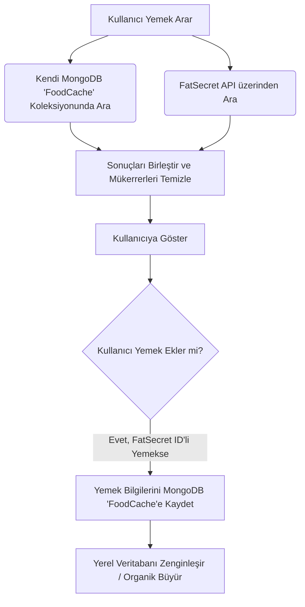

# Mimari Rehber: MongoDB, Server Actions ve Better Auth Entegrasyonu

Bu projede veritabanı olarak **MongoDB**, backend işlemleri için **Next.js Server Actions** ve kimlik doğrulama için **Better Auth** kullanıyoruz. Bu belgede, projenin mimari yapısını, yerel yemek veritabanı (Food Cache) akışını ve bu teknolojilerin entegrasyon detaylarını inceleyebilirsiniz.

---

## 1. Veritabanı (MongoDB / Mongoose) & Hibrit Yemek Arama Mekanizması

Projeye MongoDB bağlantısı `mongoose` kullanılarak sağlanıyor. Bağlantı nesnesi global olarak önbelleğe (cache) alınarak sunucu performansı maksimize ediliyor.

### 1.1 Veritabanı Bağlantısı (`src/lib/db.ts`)
```typescript
import mongoose from 'mongoose';

const MONGODB_URI = process.env.MONGODB_URI;

let cached = (global as any).mongoose;
if (!cached) {
  cached = (global as any).mongoose = { conn: null, promise: null };
}

export const connectDB = async () => {
  if (cached.conn) return cached.conn;

  if (!cached.promise) {
    cached.promise = mongoose.connect(MONGODB_URI!).then((mongoose) => mongoose);
  }
  
  cached.conn = await cached.promise;
  return cached.conn;
};
```

### 1.2 Hibrit Yemek Veritabanı Sorgulama ve Kullanıcı Veri Akışı
Kullanıcıların beslenme takibini hızlandırmak ve harici API bağımlılıklarını (FatSecret) optimize etmek amacıyla projede hibrit bir arama ve yerel önbellekleme (caching) mekanizması uygulanmıştır.



#### Arama ve Önbellek Akış Detayları:
1. **Eşzamanlı Sorgulama:** Kullanıcı bir besin araması yaptığında sistem, hem yerel MongoDB veritabanımızdaki `FoodCache` koleksiyonunu tarar hem de paralel olarak FatSecret API'sine istek gönderir.
2. **Kombinasyon & Benzersizleştirme:** Her iki kaynaktan gelen sonuçlar birleştirilir. `food_id` baz alınarak mükerrer olan kayıtlar ayıklanır. Böylelikle yerel veriler kullanıcıya anında ulaştırılırken, eksik veriler harici API'den tamamlanır.
3. **Kullanıcı Kaynaklı Veri Akışı (Data Flow):** 
   - Bir kullanıcı FatSecret API'sinden gelen (henüz yerel veritabanımızda bulunmayan) bir yemeği kendi günlüğüne eklediği anda, o yemeğin makro değerleri, kalori bilgisi ve porsiyon detayları arka planda otomatik olarak MongoDB'deki `FoodCache` koleksiyonumuza kaydedilir.
   - Bu sayede kullanıcılar uygulamayı aktif olarak kullandıkça ve yeni yemekler kaydettikçe, yerel veritabanımız organik olarak büyür. Sonraki sorgulamalarda aynı yemekler dış API'ye istek atmaya gerek kalmadan doğrudan yerel MongoDB'mizden çok daha hızlı servis edilir.

---

## 2. Kimlik Doğrulama (Better Auth) Entegrasyonu

**Better Auth**, projenin kimlik doğrulama (authentication) ve oturum (session) yönetimini üstlenen modern bir kütüphanedir.

### 2.1 Güvenlik, Oturum ve Çerez Yönetimi
- **MongoDB Adaptörü:** `@better-auth/mongo-adapter` kullanılarak Better Auth doğrudan projenin ana MongoDB veritabanına bağlanır. Kullanıcılar, oturumlar ve hesaplar tek bir veri tabanında ilişkisel kurallarla yönetilir.
- **Session Güvenliği:** Oturumlar tarayıcı tarafında HttpOnly ve güvenli çerezler (cookies) aracılığıyla takip edilir. Sunucu tarafında (Server Components & Actions) oturum doğrulaması `auth.api.getSession({ headers: await headers() })` çağrısı ile tamamen güvenli bir şekilde yapılır.
- **Oturum ve Önbellek Güncellemesi:** Kullanıcı adı güncellemesi gibi profil değişikliklerinde doğrudan veritabanına yazmak yerine Better Auth'un `auth.api.updateUser` API'si tetiklenir. Bu sayede veritabanındaki kayıt güncellenirken Better Auth kullanıcının tarayıcıdaki session cache/çerez yapısını da otomatik olarak yeniler. Böylece kullanıcı sayfayı yenilemek zorunda kalmadan yeni bilgiler arayüzde anında güncellenir.

### 2.2 Auth Tanımlaması (`src/lib/auth.ts`)
```typescript
import { betterAuth } from "better-auth";
import { mongodbAdapter } from "@better-auth/mongo-adapter";
import { MongoClient } from "mongodb";

const client = new MongoClient(process.env.MONGODB_URI!);
const db = client.db();

export const auth = betterAuth({
    database: mongodbAdapter(db),
    emailAndPassword: {
        enabled: true,
        sendResetPassword: async ({ user, url }) => {
          console.log(`Reset link: ${url}`);
        }
    },
});
```

---

## 3. Server Actions ile Güvenli ve Tip Güvenli İş Akışı

Next.js Server Actions (`"use server";`) sayesinde istemci (client) tarafında API rotaları (REST API endpoints) yazmaya gerek kalmadan, doğrudan sunucu üzerinde çalışan fonksiyonlar tanımlayabiliyoruz.

### 3.1 Server Actions'ın Sağladığı Avantajlar
- **Azaltılmış API Saldırı Yüzeyi (Zero API Surface):** Klasik `/api/user/update` gibi harici URL'ler oluşturulmadığı için kötü niyetli kişilerin tarayabileceği API kapıları en aza indirgenir.
- **Sunucu Tarafında Güvenli Çalışma:** Veritabanı şifreleri, API anahtarları gibi hassas çevre değişkenleri (environment variables) istemci tarafına hiç sızmadan tamamen güvenli sunucu ortamında kalır.
- **Doğrudan Veritabanı Erişimi:** HTTP istek yükü (request payload) oluşturmadan doğrudan sunucu üzerinden Mongoose modelleri aracılığıyla MongoDB işlemleri gerçekleştirilir.
- **TypeScript ile Uçtan Uca Tip Güvenliği:** İstemciden gönderilen veriler ve sunucudan dönen yanıtlar TypeScript arayüzleri ile doğrulanır, tip hataları derleme aşamasında yakalanır.

### 3.2 Örnek Bir Server Action (`src/actions/user.ts`)
```typescript
"use server";

import mongoose from "mongoose";
import { connectDB } from "@/lib/db";
import { auth } from "@/lib/auth";
import { headers } from "next/headers";
import { User } from "@/models/User";

// 1. Session ve Kullanıcı ID'sini getiren yardımcı fonksiyon
async function getUserId() {
  const session = await auth.api.getSession({ headers: await headers() });
  if (!session || !session.user) {
    throw new Error("Unauthorized");
  }
  return session.user.id;
}

// 2. Asıl Server Action Fonksiyonu
export async function updateUserHealthProfileAction(data: {
  weight: number;
  height: number;
}) {
  try {
    // Veritabanına bağlan
    await connectDB();
    
    // Oturumdan user_id'yi al
    const userId = await getUserId();

    // Mongoose kullanarak DB'yi güncelle
    await User.updateOne(
      { _id: userId },
      {
        $set: {
          current_weight_kg: data.weight,
          "profile.height_cm": data.height,
        }
      }
    );

    return { success: true };
  } catch (e: unknown) {
    const err = e as Error;
    // Hata durumunu yönet
    return { success: false, error: err.message };
  }
}
```

### 3.3 Client Tarafından Kullanımı (ViewModel Modeli)
Biz bu projede kullanıcı arayüzünü (UI) temiz tutmak ve iş mantığını (business logic) ayırmak için **ViewModel** yapısını kullanıyoruz. İstemci, Server Action'ı sıradan bir asenkron fonksiyon gibi çağırır:

```typescript
// Örn: src/viewmodels/useOnboardingViewModel.ts
import { updateUserHealthProfileAction } from '@/actions/user';

export function useOnboardingViewModel() {
  const saveHealth = async () => {
    // Server action'ı sanki normal bir fonksiyonmuş gibi çağırıyoruz
    const res = await updateUserHealthProfileAction({
      weight: 75,
      height: 180,
    });

    if (res.success) {
      console.log("Başarıyla kaydedildi!");
    } else {
      console.error("Hata oluştu:", res.error);
    }
  };

  return { saveHealth };
}
```
